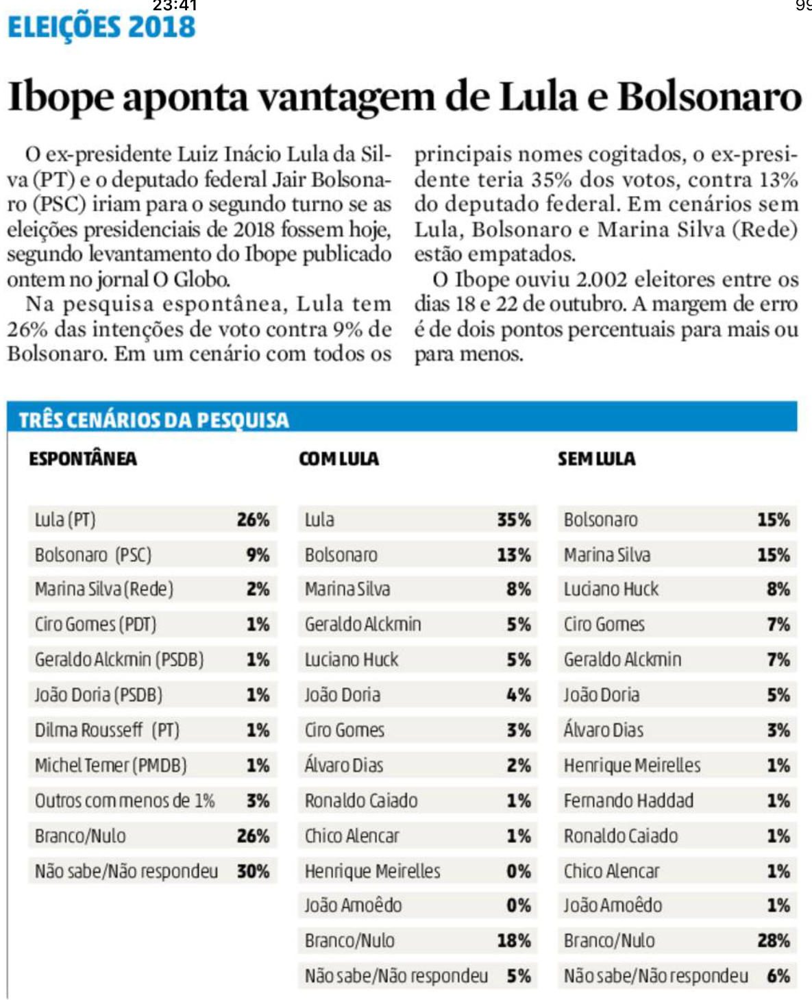

```{r setup, include=FALSE}
knitr::opts_chunk$set(echo = TRUE)
```

# Graph Analysis




In this picture we have a survey about the intentions of votes on 2018's elections in Brazil. However, we have three sections: spontaneous, with Lula and without Lula, respectively. What does it mean actually? Spontaneous probably is something like "hey, who are you going to vote for?". But "with Lula"? It's strange that the second survey has actually more votes for Lula. Does it mean that people changed their opinion when told that they could choose Lula? This information isn't clear and can be quite misleading.

More than that, it doesn't tell us if it was the same people who were interviewed three times. It also states that the surveys were made between October's 18th and 22nd. Which data came from which day? Since it's such a delicate question, relevant things could have happenned in the meantime, possibly changing the choices made, and this kind of information isn't present in these tables.